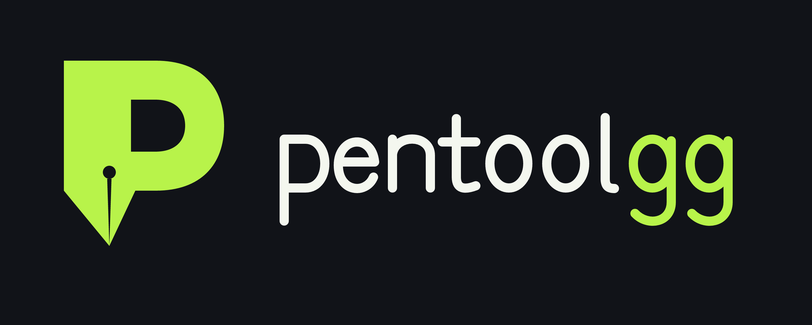
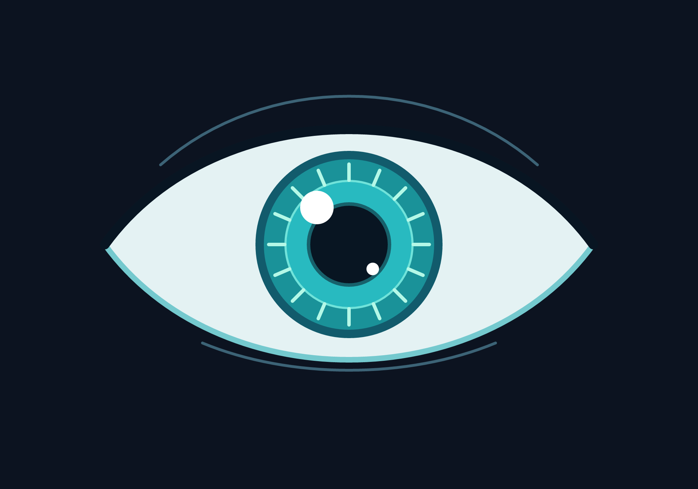
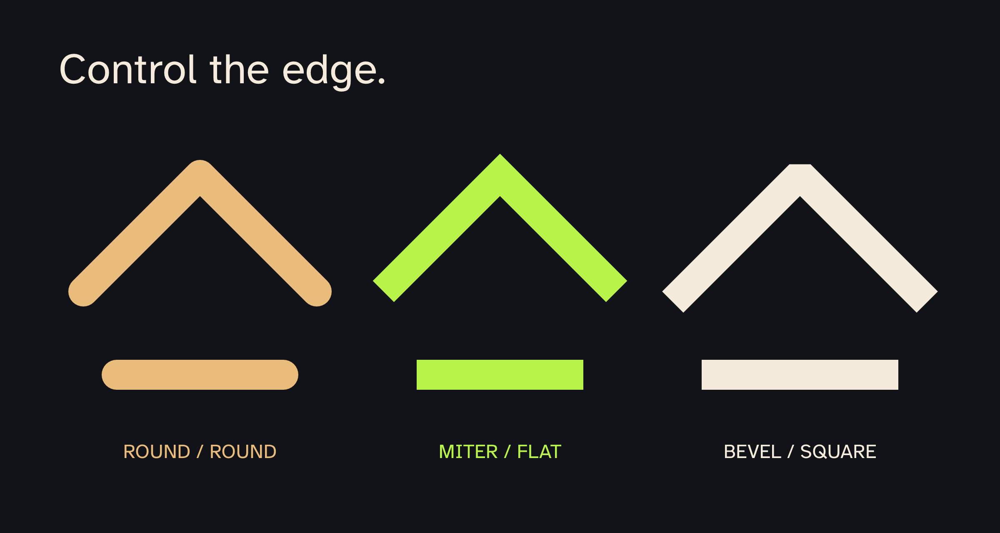
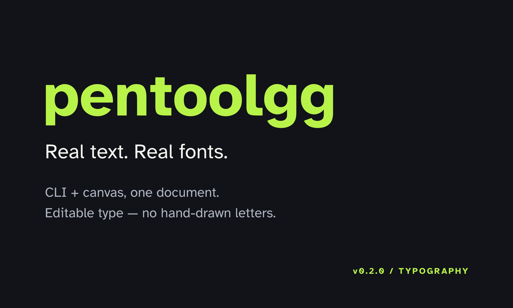

# Pentool



[Vector logo](examples/pentoolgg-logo.svg) · [Transparent icon](examples/pentoolgg-icon.png) · [Editable logo](examples/pentoolgg-logo.pen)

Pentool is an open-source, agent-friendly vector editor distributed as **one Rust binary**. It serves a browser canvas, stores editable layered artwork in a readable `.pen` JSON format, exposes rendering APIs, and exports PNG or SVG.

AI agents can draw through CLI commands; humans can edit the same artwork visually.



Try the bundled examples: `pentool serve examples/eye.pen` or
`pentool serve examples/xyskid.pen`. The eye consists of eight paths on three
artwork layers. Its 15 CLI commands, including two exports, executed in 0.202
seconds on the development machine; this excludes design time and is not a
general performance guarantee.

## Install

Download the binary for your platform from [GitHub Releases](https://github.com/agkomyint/pentoolgg/releases), put it on your `PATH`, then run:

```sh
pentool serve
```

Open `http://127.0.0.1:4711`. No Node.js, database, or external assets are required.

Build from source:

```sh
cargo install --path .
```

## CLI

**v0.3.0** adds searchable object discovery, targeted partial edits, recoverable
batch operations, and a searchable browser object tree. Text, fonts, and sharp
stroke controls introduced in v0.2.0 remain fully supported.

```sh
pentool serve --host 127.0.0.1 --port 4711
pentool new logo.pen --width 1200 --height 800
pentool info logo.pen
pentool export logo.pen logo.png --scale 2
pentool export logo.pen logo.svg
```

Running `pentool` without a command starts the server.

## Open design libraries and packages (v0.5–v0.6)

Reusable assets remain ordinary editable `.pen` documents. Save a document, page,
layer, object list, or rectangular selection, then register its folder as a local
library:

```sh
pentool asset create design.pen assets/card.pen --id ui/card --name "Card" --layer card
pentool asset create design.pen assets/icons.pen --id icons/navigation --name "Navigation icons" --rect 20 20 400 240
pentool library add ./assets --name project-assets
pentool library refresh project-assets
pentool explore card --category layout
pentool asset preview project-assets/ui/card --output card.png
```

Place an editable copy or an offline-safe instance. Instances retain materialized
content, so documents continue to render when the source library is unavailable.

```sh
pentool add poster.pen project-assets/ui/card --mode copy --at 100 80
pentool add poster.pen project-assets/ui/card --mode instance --at 400 80
pentool instance poster.pen list
pentool instance poster.pen detach instance-1
```

Versioned libraries use deterministic, data-only `.penpkg` archives. Filesystem
registries are fully functional static registries and can be hosted or mirrored by
ordinary file synchronization; the protocol does not depend on an official server.

```sh
pentool package init ./open-ui --name open-design/ui
pentool package pack ./open-ui --output open-ui-0.1.0.penpkg
pentool package verify open-ui-0.1.0.penpkg
pentool package keygen ./publisher
pentool package sign open-ui-0.1.0.penpkg --key publisher.key
pentool package verify open-ui-0.1.0.penpkg --signature open-ui-0.1.0.penpkg.sig.json --public-key publisher.pub
pentool package publish open-ui-0.1.0.penpkg --registry ./registry
pentool registry search ./registry open-design
pentool package install open-design/ui@0.1.0 --registry ./registry
pentool lock verify
pentool lock sync --offline
```

Installation verifies the archive and asset hashes, writes `pentool.lock`, and
activates the installed package in the project asset index. Package versions are
immutable. See the open, host-independent [asset and package protocol](docs/PROTOCOL.md).

Instance changes are always reviewed and explicit:

```sh
pentool instance design.pen updates instance-1 --source card-v2.pen
pentool instance design.pen update instance-1 --source card-v2.pen --dry-run
pentool instance design.pen update instance-1 --source card-v2.pen
pentool instance design.pen rollback instance-1
```

## Multiple pages (v0.4.0)

Version 3 `.pen` documents contain ordered pages, each with its own canvas and
layers. Existing v1/v2 files still open as `page-1`; adding another page upgrades
them without changing their original artwork.

```sh
pentool page design.pen list
pentool page design.pen add mobile --name "Mobile" --width 390 --height 844
pentool page design.pen duplicate mobile mobile-alt
pentool page design.pen move mobile-alt 0
pentool page design.pen rename mobile-alt "Mobile alternative"
pentool --page mobile search design.pen button
pentool --page mobile export design.pen mobile.png
```

The browser page panel switches canvases, adds, renames, and removes pages. All
editing and rendering API requests carry the selected page ID so an operation
cannot accidentally target a similarly named layer on another page.

### Compose `.pen` projects

Import another project into the selected page without flattening its paths or
text. Imports validate first and write atomically; the original destination is
retained as a numbered `.bak.N` recovery snapshot.

```sh
pentool --page mobile import design.pen icons.pen \
  --prefix icons --at 120 80 --scale 0.75 --rotate 5 --expand-canvas --dry-run
pentool --page mobile import design.pen icons.pen \
  --prefix icons --at 120 80 --revision 0123456789abcdef
```

Omit `--prefix` to derive one from the source filename, or pass `--no-prefix` to
require collision-free source IDs. Byte-identical fonts are deduplicated. Import
copies content; it does not create a live dependency.

Large searches are paginated for compact agent context:

```sh
pentool --page mobile search design.pen icon --offset 100 --limit 50
pentool benchmark --layers 1000 --objects 100000
```

## Agent discovery and safe editing (v0.3.0)

Agents no longer need to parse or rewrite a complete `.pen` document to make a
small change. Search returns stable IDs, bounds, stacking indexes, and layer state:

```sh
pentool tree artwork.pen
pentool search artwork.pen composer
pentool search artwork.pen "Open desktop app" --kind text
pentool tree artwork.pen --kind text --layer typography
```

Target an exact layer and object ID. Unspecified properties are preserved, and
each mutation retains the prior file as a numbered recovery snapshot:

```sh
pentool object artwork.pen set composer --layer ui --fill "#1c1c1c"
pentool object artwork.pen rename composer --layer ui --new-id prompt-box
pentool object artwork.pen duplicate prompt-box --layer ui --new-id prompt-copy
pentool object artwork.pen move-to-layer prompt-copy --layer ui --target-layer variants
pentool object artwork.pen reorder prompt-box --layer ui 0
```

For all-or-nothing edits, provide a JSON array of operations. `--dry-run` validates
and summarizes without writing. A committed batch creates an exact numbered
`artwork.pen.bak.N` snapshot beside the file. Pass `--revision` from a prior dry
run to reject the batch if the file changed in between.

```sh
pentool batch artwork.pen operations.json --dry-run
pentool batch artwork.pen operations.json --revision 0123456789abcdef
```

Unknown JSON extension fields follow objects through rename, duplicate, move,
and reorder. Locked source/target layers reject mutations. Object matching never
guesses: mutation commands require exact layer and object IDs. Inside a layer,
paths render first and text renders above them; `tree` exposes explicit
`draw_order` values. In the browser, the searchable Layers panel uses the same
Rust editing operations for object rename, duplicate, reorder, and delete.

## Browser-free drawing and shared editing

The CLI creates and edits artwork without a browser or running server. Path data
uses SVG commands: `M` to move, `L` for straight strokes, `C` for cubic Bézier
curves, `Q` for quadratic curves, `A` for arcs, and `Z` to close a shape.

```sh
pentool new artwork.pen --width 800 --height 600
pentool canvas artwork.pen --name "Agent artwork" --background "#ffffff"
pentool layer artwork.pen add ink --name "Ink strokes"
pentool path artwork.pen put curve --layer ink --d "M 80 300 C 160 80 440 80 520 300" --stroke "#2563eb" --width 8
pentool path artwork.pen put triangle --layer ink --d "M 550 100 L 700 350 L 400 350" --closed --fill "#b8f34a"
pentool export artwork.pen artwork.png
pentool export artwork.pen artwork.svg
pentool serve artwork.pen
```

Open `http://127.0.0.1:4711` to view and edit the shared file. **Save shared**
writes browser edits back to that file. **Reload shared** reads the latest CLI
edits. A save is rejected if the file changed since loading; reload before
editing again. Synchronization is explicit, not automatic.

`path put` replaces an existing path with the same ID in that layer. Use
`path remove artwork.pen curve --layer ink` to delete it. Layer commands support
`set ink --name "Details" --visible false --locked true`, `move ink 0`
(back-to-front index), and `remove ink`. Locked layers reject path changes.
`info` prints the complete JSON document for agents to inspect. Existing JSON
extension fields are retained by CLI edits. Run any command with `--help` for
its arguments.

The optional shared-file server exposes `GET /api/document` (document and opaque
revision token) and `PUT /api/document` with
`{ "revision": "<loaded token>", "document": <edited document> }`.
Retain the token from loading or the last successful save. Legacy `base` requests
remain supported, but revision tokens avoid browser number-conversion conflicts.
Rendering APIs also work independently of a shared document.

## Stroke edges (v0.2.0)

New CLI/browser paths use flat caps and sharp corners by default. Existing paths
without edge properties retain their original round styling. Choose end caps
(`butt`, `round`, `square`), corner joins (`miter`, `round`, `bevel`), and a miter
limit in the browser Style inspector, JSON, or CLI:

```sh
pentool path artwork.pen put angle --layer ink --d "M 100 300 L 200 100 L 300 300" --stroke "#b8f34a" --width 20 --cap butt --join miter --miter-limit 8
pentool path artwork.pen style angle --layer ink --cap square --join bevel
```

`path style` preserves geometry and colors. Miter joins form sharp stroke points;
corners exceeding the miter limit fall back to beveling. Limits are finite values
from 1 to 1000. The same settings drive browser previews, native PNG, and SVG.
Caps/joins affect strokes, not filled silhouettes. Sharp versus smooth curve
anchors are controlled separately by their Bézier handles. Stroke hit tests
remain centerline-based approximations, not exact cap/join hit tests.



Open the editable comparison with `pentool serve examples/stroke-edges.pen`.

## Editable text and fonts (v0.2.0)

Text is stored as content and typography, not hand-drawn strokes. The Rust CLI
creates, measures, transforms, and renders it without opening a browser.

```sh
pentool new typography.pen --width 1200 --height 720
pentool text typography.pen put title --layer layer-1 --content "pentoolgg" --x 100 --y 240 --size 120 --weight 700
pentool text typography.pen set title --layer layer-1 --content "Still editable" --italic true
pentool geometry typography.pen --layer layer-1 --id title bounds
pentool layer-geometry typography.pen --layer layer-1 translate 30 20
pentool export typography.pen typography.png --scale 2
pentool export typography.pen typography.svg
pentool export typography.pen typography-outlined.svg --outline-text
pentool fonts
pentool font typography.pen add brand-font --file ./brand-font.ttf
pentool text typography.pen set title --layer layer-1 --font "Your Font Family"
pentool serve typography.pen
```

Use `text put` to create/replace, `text set` to change only supplied properties,
and `text remove` to delete. Options include family, size, weight, italic, fill,
left/center/right alignment, letter spacing, and line-height multiplier.
`x`/`y` position the first line's baseline; explicit newlines create more lines.
Whole-layer transforms move paths and text together; text remains editable.
Text hit testing uses layout bounds, not pixel-perfect glyph outlines.

In the browser, choose **Text (T)**, enter content/style in the inspector, and
click the canvas. Use **Select (V)** to edit or drag text. **Embed TTF / OTF font**
stores a font in the document; normal undo and shared saving work with text.

Atkinson Hyperlegible regular, bold, italic, and bold italic are bundled in the
binary, so the default needs no installed fonts or network. Other requested
weights use the closest available font face. Installed fonts are also available
for native rendering, but a remote browser might not have them: embed custom
TTF/OTF files you are licensed to redistribute for portable artwork. Family
names come from font metadata, not filenames. Generic family aliases resolve
to the bundled default in native rendering; use explicit family names for
consistent browser previews.

Live SVG exports contain `<text>` plus bundled/embedded font data. Some SVG
consumers do not support embedded fonts; `--outline-text` exports glyph paths
instead, while the original `.pen` keeps editable text. PNG uses native font
shaping and rasterization. System-only fonts are not embedded automatically.
The initial text feature has no rich-text spans, automatic wrapping, text-on-path,
variable-font axes, or text-outline editing inside `.pen`.



Try `pentool serve examples/text-demo.pen`. [Live SVG](examples/text-demo.svg) ·
[Outlined SVG](examples/text-demo-outlined.svg) · [Editable document](examples/text-demo.pen)

The API adds `POST /api/text` with `{ "document": {}, "action":
{ "type": "put", "id": "title", "layer": "layer-1", "content": "Hello" } }`.
Use `type: "set"` or `"remove"` for updates/deletion. `GET /api/fonts` lists faces;
`POST /api/font` accepts `{ "document": {}, "id": "brand", "data": "<base64 TTF/OTF>" }`.
These operations return the updated document without writing the shared file.

### Rust dependencies

`resvg`/`usvg` provide SVG rendering, font discovery/parsing (`fontdb`), and
glyph shaping (`rustybuzz`); `tiny-skia` rasterizes PNG; `kurbo` handles vector
geometry. `serde`/`serde_json` serialize documents, `base64` packages font data,
`clap` supplies the CLI, and `axum`/`tokio` supply the optional HTTP server.
No JavaScript runtime is required to use or build the native renderer.

## Shared Rust geometry engine

CLI operations and browser Geometry controls use the same `kurbo`-based Rust
engine. It is also exposed as a Rust library (`pentool::geometry`) for future
desktop frontends. No browser is needed for calculations.

```sh
pentool geometry artwork.pen --layer ink --id curve bounds
pentool geometry artwork.pen --layer ink --id curve nodes
pentool geometry artwork.pen --layer ink --id curve hit 200 300 --tolerance 4
pentool geometry artwork.pen --layer ink --id curve translate 20 30
pentool geometry artwork.pen --layer ink --id curve rotate 45 --cx 400 --cy 300
pentool geometry artwork.pen --layer ink --id curve scale 1.5 1.5
pentool geometry artwork.pen --layer ink --id curve move-anchor 0 120 320
pentool geometry artwork.pen --layer ink --id curve set-handle 1 1 180 100
pentool geometry artwork.pen --layer ink --id curve split 0 0.5
pentool layer-geometry artwork.pen --layer ink translate 40 20
```

Layer transforms move every shape, stroke, and fill in that layer together,
preserving stacking order and other layers. Locked layers reject mutations.
Layer changes are calculated completely before applying them. Transforms change
path coordinates; stroke width remains unchanged. Bounds describe geometry,
excluding stroke width. Hit tests use nonzero fill winding and distance to the
stroke centerline plus width/tolerance; they are not pixel-perfect cap/join tests.

`nodes` exposes zero-based anchor indexes and normalized element/handle indexes.
SVG relative commands are normalized; arcs become Bézier approximations when
edited. Re-query nodes after a mutation, especially splitting a segment.

In the browser, select a path and use **Edit anchors / handles** to display
control points and numeric inputs. Drag a displayed anchor/handle to edit it.
Click a path to select it, then drag to move it; set Geometry Target to **Active
layer** to move the whole layer. Move/Rotate/Scale controls also work on either
target. Rotations/scales in the UI use the document origin; CLI commands support
a custom pivot. Geometry edits are undoable with Ctrl+Z / Ctrl+Shift+Z.

`POST /api/geometry` takes:

```json
{"document": {}, "layer": "ink", "id": "curve", "operation": {"type": "translate", "dx": 20, "dy": 30}}
```

Replace `document` with a complete `.pen` document. Omit `id` (or use null) for
a layer transform. The response contains `document` and `result`; computation
does not write the shared file until the browser saves through `/api/document`.

This is a geometry foundation, not yet a full desktop editor: shape boolean
operations, automatic snapping/alignment, complete editing history, and native
desktop window integration remain future work.

## Agent rendering API

The server accepts a complete `.pen` document and returns a rendered file:

```sh
curl -X POST http://127.0.0.1:4711/api/render/png \
  -H "content-type: application/json" \
  --data-binary @logo.pen \
  --output logo.png
```

Endpoints:

- `GET /api/health`
- `POST /api/render/png`
- `POST /api/render/svg`

The API is intentionally simple: an AI agent can create or edit the human-readable path data, preserve layers, and ask the same binary to render it. Canvas dimensions are capped at 16,384 px and request bodies at 16 MiB.

## `.pen` format

`.pen` is versioned JSON containing canvas metadata, ordered layers, and SVG-compatible path data. See [`examples/logo.pen`](examples/logo.pen) and [`docs/pen-format.md`](docs/pen-format.md).

## License

Dual-licensed under MIT or Apache-2.0, at your option.

Bundled fonts have a separate [SIL Open Font License](assets/fonts/OFL.txt).
See [font attribution](assets/fonts/README.md).
