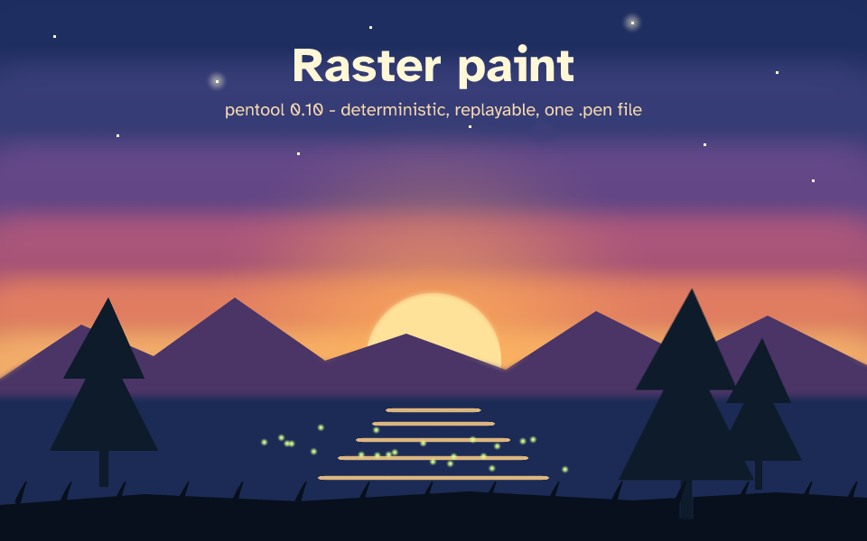

# Raster paint showcase (pentool 0.10)



`raster-paint-showcase.pen` is a 960x600 dusk landscape painted entirely with the
CLI: no imported images. Open it with `pentool serve examples/raster-paint-showcase.pen`
and use the Raster panel to keep painting.

Rebuild it from scratch (needs `pentool` on `PATH`, or set `P=/path/to/pentool`):

```sh
bash examples/raster-paint-showcase.sh
```

The build is deterministic: the same script produces a byte-identical `.pen` on every
platform, and `pentool raster examples/raster-paint-showcase.pen verify sky --replay`
proves each layer's stroke journal still reproduces its pixels.

| Feature | Where it appears |
|---|---|
| Soft-round brush, opacity, layered strokes | sky gradient bands, sun glow |
| Pixel brush | stars |
| Blur tool (`--blend blur`) | haze across the horizon |
| Lasso selection + flood fill | mountain ridge, pine tree, foreground ground |
| Feathered marquee | lake shoreline |
| Calligraphic brush | sun reflection on the water |
| Clone stamp with scale | one painted pine cloned twice at 1.25x and 0.8x |
| Pressure-tapered strokes | grass blades (`pressure_size`, `min_size`) |
| Scatter + seed | fireflies |
| Spot healing | a stray dab on the sky is healed away |
| Raster + vector in one file | editable title text over the paint |
